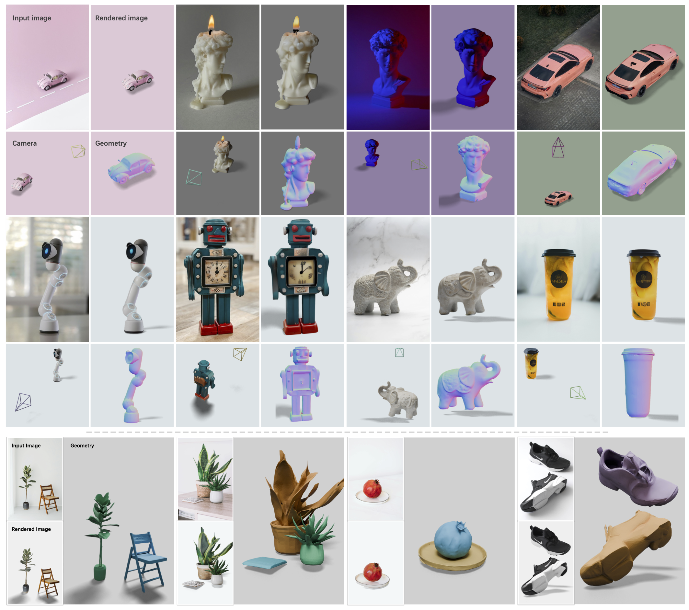

<h2 align="center">CUPID: Pose-Grounded Generative 3D Reconstruction from a Single Image</h2>
<h5 align="center">


[](https://arxiv.org/abs/2510.20776) 
[](https://cupid3d.github.io/) 
</h5>

<!-- <div align="center">
TL;DR: one image to cannonically posed 3D object and object-centric camera.
</div> -->
<div class="rounded" style="text-align: center; padding-bottom: 0px; padding-top: 5px;">
                <div style="text-align: center; color:rgb(0, 0, 0); margin-top: 10px; margin-bottom: 10px;"><strong>TL;DR</strong>: Create <i>canonically posed</i> 3D objects and <i>object-centric cameras</i> from any images in a few forward steps.</div>
    </div>
<br>

<p align="center"></p>

<p align="center"><strong>Results for pose-grounded <em>generative 3D reconstruction</em> from a single test image.</strong> Given an input image (top left), CUPID estimates camera pose (bottom left) and reconstructs a 3D model (bottom right), re-rendering the input (top right). It is robust to changes in scale, placement, and lighting while preserving fine texture, and supports component-aligned scene reconstruction (bottom row). All results are produced in seconds via feed-forward sampling of the learned model. See <a href="https://cupid3d.github.io/#sec:interactive_demo">cupid3d.github.io</a> for an immersive view of the interactive 3D results.</p>


## 🚧 Code

The code is currently under development and is expected to be released by January 2026. For progress updates and the official release, please check the project website or the GitHub repository.

## Citation

If you want to cite our work, please use:

```bibtex
@article{huang2025cupid,
  title={CUPID: Pose-Grounded Generative 3D Reconstruction from a Single Image},
  author={Huang, Binbin and Duan, Haobin and Zhao, Yiqun and Zhao, Zibo and Ma, Yi and Gao, Shenghua},
  journal={arXiv preprint arXiv:2510.20776},
  year={2025}
}
```