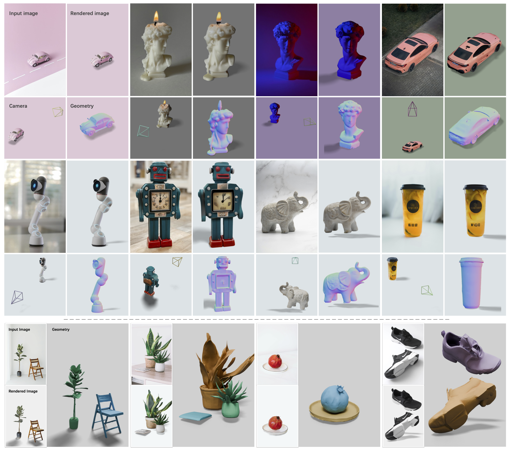

<div align="center">

  <h1>💘 CUPID: Generative 3D Reconstruction <br> via Joint Object and Pose Modeling</h1>

  <!-- Badges -->
  <p>
    <a href="https://arxiv.org/abs/2510.20776">
      
    </a>
    <a href="https://cupid3d.github.io/">
      
    </a>
  </p>

  <!-- TL;DR Box -->
  <div style="background-color: rgba(0, 0, 0, 0.05); border-radius: 8px; padding: 10px; display: inline-block; margin: 10px 0;">
    <strong>TL;DR:</strong> Create one or many 3D objects that can be composited back into the image.
  </div>

  <br>

  <!-- Teaser Image -->
  

</div>

<!-- Caption -->
<p align="left" style="font-size: 0.95em; line-height: 1.5; margin-top: 15px;">
  <!-- <strong>Results for <em>generative 3D reconstruction</em> from a single test image.</strong><br> -->
  Given an input image (top left), CUPID estimates camera pose (bottom left) and reconstructs a 3D model (bottom right), re-rendering the input (top right). It is robust to changes in scale, placement, and lighting while preserving fine texture, and supports component-aligned scene reconstruction (bottom row). All results are produced in seconds via feed-forward sampling of the learned model. See <a href="https://cupid3d.github.io/#sec:interactive_demo">cupid3d.github.io</a> for an immersive view of the interactive 3D results.
</p>

## 📦 Installation

### Prerequisites

*   **🐧 System**: The code is currently tested only on **Linux**. For Windows setup, you may refer to issues in the original repository (not fully tested).
*   **🖥️ Hardware**: An NVIDIA GPU with at least **16GB of memory** is necessary. The code has been verified on NVIDIA A100 and A6000 GPUs.
*   **⚙️ Software**:
    *   The **CUDA Toolkit** is needed to compile certain submodules. The code has been tested with CUDA versions 11.8 and 12.2.
    *   **Conda** is recommended for managing dependencies.
    *   Python version 3.8 or higher is required.

### Installation Steps

1.  **Clone the repository:**

    ```bash
    git clone --recurse-submodules https://github.com/cupid3d/Cupid.git
    cd Cupid
    ```

2.  **Install dependencies:**

    > **⚠️ Note before running:**
    > *   **Environment:** Adding `--new-env` creates a new conda environment named `cupid`. Remove this flag to use an existing environment.
    > *   **CUDA Version:** Default is PyTorch 2.4.0 with CUDA 11.8. If you have a different CUDA Toolkit (e.g., 12.2), remove `--new-env` and install PyTorch manually first.
    > *   **Multiple CUDA Versions:** If you have multiple versions installed, set your path first:
    >     `export PATH=/usr/local/cuda-11.8/bin:$PATH`
    > *   **Attention Backend:** Default is `flash-attn`. For unsupported GPUs (e.g., V100), remove `--flash-attn` and set `os.environ['ATTN_BACKEND'] = 'xformers'`.

    **Create environment and install:**

    ```bash
    . ./setup.sh --new-env --basic --xformers --flash-attn --diffoctreerast --spconv --mipgaussian --kaolin --nvdiffrast --pytorch3d --moge
    ```

    *For detailed usage options, run `. ./setup.sh --help`.*

## 🤖 Pretrained Models

The pipeline uses the pretrained model hosted on Hugging Face. The code automatically handles downloading:

*   **Model ID:** `hbb1/Cupid`

## 💡 Usage

### 1. Single Object 3D Reconstruction 🗿

Reconstruct a single object from an image, render a comparison, and save the mesh.

```python
import os
os.environ['SPCONV_ALGO'] = 'native'  # Use 'auto' for faster repeated runs

import imageio
import numpy as np
from PIL import Image
from cupid.pipelines import Cupid3DPipeline
from cupid.utils import render_utils, sample_utils
from cupid.utils.align_utils import save_mesh

# Load pipeline
pipeline = Cupid3DPipeline.from_pretrained("hbb1/Cupid")
pipeline.cuda()

# Load input image and run reconstruction
image = sample_utils.load_image("assets/example_image/typical_creature_dragon.png")
outputs = pipeline.run(image)

# outputs contains:
#   - 'gaussian': 3D Gaussians
#   - 'radiance_field': radiance fields
#   - 'mesh': meshes
#   - 'pose': camera extrinsic and intrinsic parameters

# Save side-by-side comparison (input vs rendered)
render_rgb = render_utils.render_pose(outputs['gaussian'][0], outputs['pose'][0])['color'][0]
input_rgb = Image.alpha_composite(Image.new("RGBA", image.size, (0, 0, 0, 255)), image)
input_rgb = np.array(input_rgb.resize((512, 512), Image.Resampling.LANCZOS).convert('RGB'))
imageio.imwrite('sample.png', np.concatenate([input_rgb, render_rgb], axis=1))

# Save mesh and camera pose
save_mesh(
    all_outputs=outputs,
    poses=outputs.pop('pose'),
    output_dir='output'
)
```

**Output Files:**
After running the code, the `output` directory will contain:
*   `mesh0.glb`: A GLB file containing the extracted textured mesh.
*   `metadata.json`: A JSON file containing the camera extrinsics and intrinsics.
*   `sample.png`: The side-by-side comparison (input vs rendered)

**Convert to Blender:**
You can convert the GLB and metadata into a `.blend` file using:
```bash
python convert_blender.py --meta_file output/metadata.json --output_path output/scene.blend --save_file
```

---

### 2. Multi-Object Scene Reconstruction 🏙️

Cupid3D can reconstruct multiple objects from a single image using segmentation masks and align them into a cohesive scene.
*Note: Currently, we only support non-occluded assets.*

```python
import os
import glob

os.environ['SPCONV_ALGO'] = 'native'  # Skip benchmarking for one-off runs

from cupid.pipelines import Cupid3DPipeline
from cupid.utils.align_utils import Aligner
from cupid.utils import sample_utils

# Load pipeline
pipeline = Cupid3DPipeline.from_pretrained("hbb1/Cupid")
pipeline.cuda()

# Load image and segmentation masks
image = sample_utils.load_image("assets/multi_no_occ/pexels-anna-nekrashevich-7214602.jpg")
masks = [sample_utils.load_image(p) for p in sorted(glob.glob("assets/multi_no_occ/pexels-anna-nekrashevich-7214602/segmentation_*.png"))]

# Run 3D reconstruction for each object
objects = [pipeline.run(image, mask=mask) for mask in masks]

# Align and export individual meshes
aligner = Aligner(image, objects=objects)
aligner.export_meshes("result")

# Compose all meshes into a single file (optional)
Aligner.compose_mesh_from_metadata(
    meta_file="result/metadata.json",
    output_path="result/composed.glb"
)
```

**Output Files:**
After running the code, the `result` directory will contain:
*   `mesh{...}.glb`: Multiple GLB files containing the extracted textured meshes.
*   `metadata.json`: A JSON file containing the camera extrinsics and intrinsics.
*   `composed.glb`: A single GLB file containing all the composed textured meshes.

**Convert to Blender:**
Similarly, you can convert the GLB and metadata into a `.blend` file using:
```bash
python convert_blender.py --meta_file output/metadata.json --output_path output/scene.blend --save_file
```

## 🚀 Feedbacks & Contributing
We welcome feedback and contributions from the community!

*   **Request a Feature**: Have a great idea? [Open a Feature Request](https://github.com/cupid3d/Cupid/issues/new?labels=enhancement).
*   **Report a Bug**: Found something broken? [Open a Bug Report](https://github.com/cupid3d/Cupid/issues/new?labels=bug).
*   **Contribute**: Want to build it yourself? Feel free to fork the repository and submit a Pull Request.


## ⚖️ Acknowledgment and License

The code is heavily built upon [TRELLIS](https://github.com/microsoft/TRELLIS). We thank for their great job! The models and the majority of the code are licensed under the [MIT License](LICENSE). The following submodules may have different licenses:

*   **[diffoctreerast](https://github.com/hbb1/diffoctreerast)**: We slightly modifed this CUDA-based real-time [differentiable octree renderer](https://github.com/JeffreyXiang/diffoctreerast) to support non-center rendering. This renderer is derived from the [diff-gaussian-rasterization](https://github.com/graphdeco-inria/diff-gaussian-rasterization) project and is available under the [LICENSE](https://github.com/JeffreyXiang/diffoctreerast/blob/master/LICENSE).
*   **Modified Flexicubes**: In this project, we used a modified version of [FlexiCubes](https://github.com/nv-tlabs/FlexiCubes) to support vertex attributes. This modified version is licensed under the [LICENSE](https://github.com/nv-tlabs/FlexiCubes/blob/main/LICENSE.txt).

## 📜 Citation

If you find this work helpful, please consider citing our paper:

```bib
@article{huang2025cupid,
  title={CUPID: Generative 3D Reconstruction via Joint Object and Pose Modeling},
  author={Huang, Binbin and Duan, Haobin and Zhao, Yiqun and Zhao, Zibo and Ma, Yi and Gao, Shenghua},
  journal={arXiv preprint arXiv:2510.20776},
  year={2025}
}
```